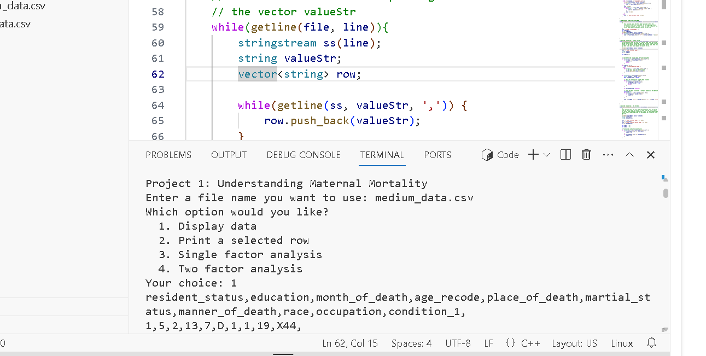

# maternal-mortality-analyzer
A C++ console application that analyzes real maternal mortality datasets to identify trends and relationships between contributing factors. The project demonstrates proficiency in file I/O, data structures, and user-driven data analysis.

## Features
- Choose between three datasets: small, medium, and large
- Display entire dataset or a specific row
- Perform single-factor and two-factor analyses
- Handle user input with input validation
- 
- ## Technologies Used
- C++
- File I/O
- Arrays and vectors
- Loops and conditional logic

- ## How to Run
1. Clone this repository:
2. git clone https://github.com/devtom9/maternal-mortality-analyzer.git
3. cd maternal-mortality-analyzer
4. g++ main.cpp -o analyzer
5. ./analyzer

## How to use program
Enter a data file, options: small_data.csv, medium_data.csv, large_data.csv
Then select the operation you would like to perform, options: Display file, Print selected row, Single factor analysis, and two factor analysis.
For single and two factor analysis, you will be asked to input a factor. Here are the factors present in the dataset:
resident_status, education, month_of_death, age_recode, place_of_death, martial_status, manner_of_death, race, occupation, and condition_1.
Each column corresponds to the factors listed above respectively.

Here is the link to the Dataset, code and value definitions: https://docs.google.com/document/d/1K1aOTzFVWrthwQR0SljiTBUk-XzNsBkbm_0rgZbtR9Q/edit?tab=t.0#heading=h.8abub6nzdoks

## Preview

